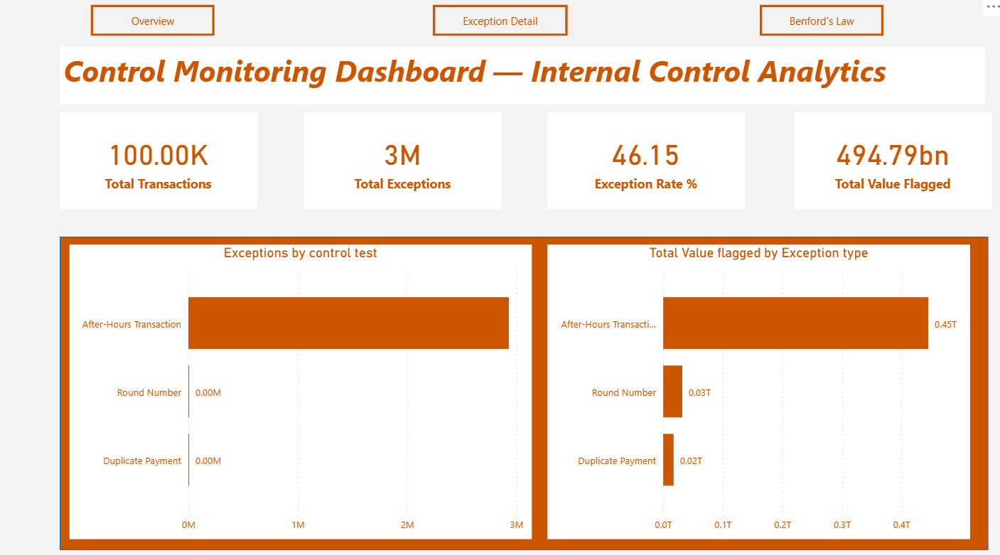

# Continuous Control Monitoring & Anomaly Detection System

**Domain:** Internal Control Analytics | Financial Services  
**Tools:** Python (pandas, numpy, matplotlib) | Power BI  
**Dataset:** PaySim Synthetic Financial Transactions (Kaggle)

---

## Overview

This project implements a **Continuous Control Monitoring (CCM)** framework applied to financial transaction data, simulating the kind of automated control testing used within internal control functions in financial services organisations.

Rather than periodic manual reviews, CCM enables automated, ongoing exception detection — increasing review coverage while reducing cost and time. This project demonstrates how data analytics can be applied directly to internal control objectives: identifying anomalies, flagging exceptions, and surfacing insights for control teams and management.

---



## Control Tests Implemented

| # | Control Test | Risk Addressed | Method |
|---|---|---|---|
| 1 | **Benford's Law Analysis** | Manipulation / fabrication of financial figures | Leading digit frequency analysis vs expected distribution |
| 2 | **Duplicate Payment Detection** | Duplicate disbursements / system control failures | Exact match on amount + destination + date + type |
| 3 | **Round Number Analysis** | Fraudulent or estimated entries | Flagging amounts divisible by threshold value |
| 4 | **After-Hours Transaction Detection** | Unauthorised access / circumvention of oversight | Timestamp analysis outside defined business hours |

---

## Project Structure

```
control-analytics/
│
├── data/
│   └── transactions.csv           # PaySim dataset (download from Kaggle)
│
├── notebooks/
│   └── control_analysis.ipynb     # Main analysis notebook
│
├── outputs/                       # Auto-generated by script
│   ├── benford_analysis.csv       # Benford digit comparison table
│   ├── benford_chart.png          # Expected vs actual digit chart
│   ├── duplicate_exceptions.csv   # Flagged duplicate transactions
│   ├── round_number_exceptions.csv
│   ├── after_hours_exceptions.csv
│   ├── master_exceptions.csv      # All exceptions consolidated
│   ├── exceptions_summary.csv     # Summary KPI table
│   └── transactions_flagged.csv   # Full dataset with exception flags
│
├── control_analysis.py            # Standalone Python script
└── README.md
```

---

## How to Run

### 1. Install dependencies
```bash
pip install pandas numpy matplotlib
```

### 2. Download the dataset
- Go to: https://www.kaggle.com/datasets/ealaxi/paysim1
- Download `PS_20174392719_1491204439457_log.csv`
- Rename it to `transactions.csv` and place in the `data/` folder

### 3. Run the script
```bash
python control_analysis.py
```
Or open and run `notebooks/control_analysis.ipynb` cell by cell.

### 4. Open the Power BI dashboard
- Open `Control_Monitoring_Dashboard.pbix` in Power BI Desktop
- Refresh data source pointing to the `outputs/` folder

---

## Key Outputs & Findings

After running the analysis on the PaySim dataset (~6.3M transactions):

- **Benford's Law:** Identified digit deviation patterns consistent with the synthetic nature of the dataset — in a real environment, significant deviations would trigger escalation
- **Duplicate Payments:** Flagged transactions sharing identical destination, amount, type, and date — surfaced for control team review
- **Round Numbers:** Identified a subset of transactions with amounts that are exact multiples of 1,000 — flagged for analytical review
- **After-Hours Activity:** Quantified the volume and distribution of transactions outside defined business hours (08:00–17:00), with hourly breakdown

Other Metrics that can be checked include:

**High value transactions**,
**Rapid Transactions (Velocity Check)**,
**Missing / Invalid Data (Data Integrity)**.

All exceptions are consolidated into a master exceptions table and visualised in the Power BI dashboard.

---

## Power BI Dashboard Pages

| Page | Content |
|---|---|
| **Overview** | Total transactions, exception count, exception rate KPIs, exception trend over time |
| **Exception Detail** | Filterable table of all flagged transactions by test type, amount, and date |
| **Benford's Law** | Bar chart: expected vs actual leading digit distribution with deviation callouts |

---

## Relevance to Internal Control

This project directly maps to key internal control analytics capabilities:

- **Continuous Control Monitoring (CCM)** — automated, rule-based testing replacing periodic manual reviews
- **Exception-based reporting** — surfacing only what requires human attention
- **Key Risk Indicators (KRIs)** — exception rates as measurable control health metrics
- **Scalable coverage** — same framework applicable across transaction types, business units, and time periods

---

## Dataset Reference

Lopez-Rojas, E., Elmir, A., & Axelsson, S. (2016). *PaySim: A financial mobile money simulator for fraud detection.* Kaggle.  
https://www.kaggle.com/datasets/ealaxi/paysim1

---

*Built as part of a portfolio demonstrating data analytics applied to internal control and risk management in financial services.*
